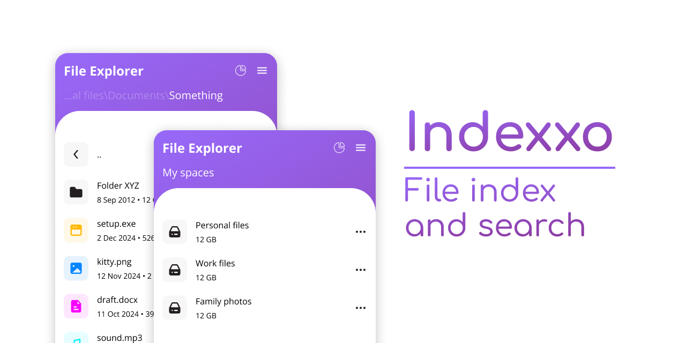

# Note: Project is not dead, I'm just busy with other projects.


Welcome to repository of a project called **Indexxo**! Below you can read some information about the app. 


Indexxo is still in on it's way to MVP. Some core features are not implement correctly or not implemented at all. Visuals and branding are not final either. 

Basically, expect some heavy changes in app behavior and look. This disclaimer will be updated after the MVP stage.


Indexxo is a lightweight blazingly super fast modern easy-to-use human friendly file indexer which uses edge technologies to deliver it's user best experience... or just a simple file indexer with web app used as frontend.

## Main goal
***Indexxo is built for efficient storage usage and management.***

## Use cases
***Even if you are on this page by accident, you may find Indexxo useful.*** Indexxo is similar to file indexer that is built in your OS (Windows, Linux and others). Check out features listed below, maybe something will convince you to try Indexxo.

## Features
0. **Search for files and folders, but fast.** Indexxo runs in background and periodically updates cached information about your folders — searching for anything on your hard drives is fast.
0. **Friendly shaped, doesn't bite.** You don't need any knowledge on how Indexxo was built in order to use it. Everything can be done from your browser (Not implemented yet). 
0. **Remote access your file indexer.**
0. **Download files from your machine remotely. (Not implemented yet)**
0. **Detailed analytics of your storage usage. (Not implemented yet)**
0. **Choose which folders to index.**
0. **Choose which folders to ignore while indexing.**
0. **Choose how often to update your index.**


## For sane people
***Not implemented yet.*** Users will be able to install Indexxo via executable files.

## For tech people
The most stable way of installing the app is via Python.

0. Install python from [python.com](https://www.python.org/downloads/) (make sure to install pip via same installer)
0. Install Indexxo via pip
    ```
    pip install -U https://github.com/sadellie/indexxo/archive/master.zip
    ```

You can now use Indexxo. Move onto the next block.


## For sane people
***Not implemented yet.*** Users will be able to change settings from web app.

## For tech people
If you have installed Indexxo via Python, you can change config.json file to modify Indexxo settings. 

### In terminal
0. In terminal call Indexxo to get template config.json file.
	```
	indexxo --get-config
	```
1. Open generated config.json file
2. [Modify parameters](#editing-configjson) in this file.
3. Save config.json file.
4. Call Indexxo and provide it path to your edited config.json file. It will read and apply those settings.
	```
	indexxo --config config.json
	```
5. Finally call Indexxo to run indexer and server
	```
	indexxo --run
	```
6. In terminal look for line that tells where the server is running.
	```
	...
	 * Running on http://localhost:5000
	...
	```
7. Open your browser and follow this url.

Everything is done. Just don't close terminal unless you want to stop Indexxo.

### Editing config.json
0. Enter folders to index. Prefer using full paths. See [How to get full paths](#How-to-get-full-paths).
	```json
		"space_paths": [
			"/first/folder/to/index/",
			"/second/folder/to/index/"
		]
	```
0. Enter folders to ignore. Prefer using full paths. See [How to get full paths](#How-to-get-full-paths).
	```json
		"ignore_paths": [
			"/first/folder/to/ignore/",
			"/second/folder/to/ignore/"
		]
	```
0. Enter the amount of seconds between each index refresh. Prefer setting bigger interval.
	```json
		"refresh_interval": 3600
	```

Your config.json should look like this:
```json
{
	"space_paths": [
		"/first/folder/to/index/",
		"/second/folder/to/index/"
	],
	"ignore_paths": [
		"/first/folder/to/ignore/",
		"/second/folder/to/ignore/"
	],
	"refresh_interval": 3600
}
```


Indexxo is still in active development. Here is a small list of things that I want to implement:
- [ ] Improve test coverage.
- [ ] List pagination.
- [ ] List sorting.
- [ ] Improve file types matching.
- [ ] Improve index refresh strategy.
- [ ] Settings screen.
- [ ] Ability to modify Indexxo settings via Web App.
- [ ] Executables instead of manual install.
- [ ] Ability to download files from Indexxo.
- [ ] Backend API reference.
- [ ] Backend index database reference.
- [ ] UI/UX improvements. Little tweaks on frontend.
- [ ] Indexxo landing page.
- [ ] Rewrite backend in C.


Any activity is welcomed. 
You can help Indexxo even by starring, sharing with friends and etc.

If you want to contribute some code improvements, feel free to do so.

Also, graphic designers are also welcomed! Icons, background, anything that will improve visuals in app or anywhere else.


This software is licensed under GNU General Public License v3.0


## App name
Index => Indexxo.

## Project structure
Backend is written in Python with Flask API and Peewee (SQLite).

Frontend is written in TypeScript and uses Vue and Tailwind.

## App data folder
Depending on your OS, Indexxo saves it's generated files in home folder. Look for folder called `indexxo`.
This folder contains index database and indexxo config.json file.

## Backend only
You don't necessarily need frontend (web app). There will be an API reference for backend and database (Not implemented yet).

## FAQ
There are no question in this repository.

## Info

### Spaces
Spaces are top level folders that are indexed. They differ from usual folders — they don't have parent folders (similar to hard drives in your machine).

### Index
Index contains information about all spaces and their contents.

### Index refresh
Index refresh is an action during which current index gets cleared (completely) and a new one comes in place.
It's recommended too use big refresh interval so that you reduce chance of experiencing empty index.

### How to get full paths
#### Windows
Navigate to the desired folder and right click on folder path (top bar). Click Copy Address as text.
#### Linux
Navigate to the desired folder and press ***Win*** and ***L*** keyboard buttons simultaneously.
#### Others
Improvise, adapt, overcome... or just search it on duckduckgo.

## Acknowledgement
Here is a list of some tools that are used in this project.
- [Vue.js]('https://vuejs.org/'). Used for frontend web app.
- [Vue Router](https://router.vuejs.org/). Used for navigation in web app.
- [peewee](https://github.com/coleifer/peewee). ORM, used to interact with SQLite database.
- [Flask](https://github.com/pallets/flask). Used for backend, REST API.
- [Tailwind CSS](https://tailwindcss.com/). Used for frontend web app. Very cool CSS framework.
- [Python](https://www.python.org). Programming language, used for backend.
- [TypeScript](https://www.typescriptlang.org). Programming language, used for frontend.
- [Figma](https://www.figma.com). Used for visuals, branding, icons, logo etc. Design tool.
- [unDraw](https://undraw.co). Collection of cool looking drawings. Used for visuals.
- [Eva Icons](https://github.com/akveo/eva-icons). Collection of cool icons. Used for frontend web app.
- [Visual Studio Code](code.visualstudio.com). Code editor. Used to write code, interact with database and API, run and debug code and etc.
- [Vite](https://vitejs.dev/). Frontend tooling. Rebuilds web app by itself.
- Me. Human.